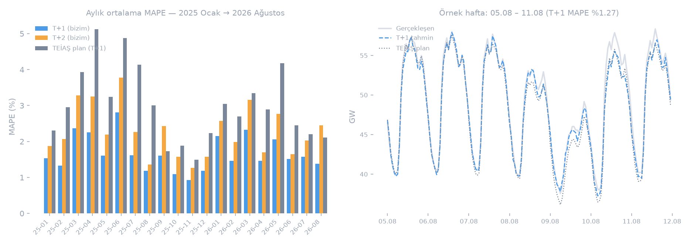

# ⚡ Türkiye Ulusal T+1/T+2 Elektrik Talep Tahmini

[](https://github.com/dattik12/turkiye-t2-daysahead/actions/workflows/daily.yml)

Her gece **03:00 (Türkiye)** 🇹🇷 EPİAŞ'tan bir önceki günün tüketimini çeker, veriyi günceller ve
**T+2 (ve T+1)** saatlik tahminini üretir. Gerçekleşen veri geldikçe tahminlerle eşleştirilir ve
**MAPE her gün loglanır** — TEİAŞ'ın kendi planıyla karşılaştırmalı.

> 🎯 *"Veri seti son günü 18 Ağustos ise bize lazım olan 20 Ağustos."*



---

## 📊 Sonuçlar · Backtest 2025-01-01 → 2026-08-18 (597 karar günü, saatlik 14.280 nokta)

| Ufuk | MAPE | MAE | Saatlerin payı |
|:---|---:|---:|:---|
| **T+1** | **%1.68** | 670 MW | %72,2'si ±%2 bandında |
| **T+2** | **%2.26** | 908 MW | %75,6'sı ±%3 bandında |
| T+2 bayram-dışı | %2.15 | — | — |
| T+2 Kurban/bayram | %4.50 | — | — |
| 🏛️ TEİAŞ load-plan (T+1, rakip) | **%3.01** | — | — |

- T+1'de resmî TEİAŞ planını **~1,4 puan** geçiyoruz — farkın en büyük olduğu dönemler
  havanın ani döndüğü geçiş ayları (soldaki grafikte gri barların öne çıktığı aylar).
- Rakamlar `data/exports/backtest_t1_t2_2025_2026.csv` üzerinden
  [`scripts/make_readme_chart.py`](scripts/make_readme_chart.py) ile yeniden üretilebilir.

### 📤 Başka ekiplerin kullanımı için temiz çıktılar (`data/exports/`)

| Dosya | İçerik | Satır |
|:--|:--|--:|
| `backtest_t1_t2_2025_2026.csv` | Saat başına tek satır: gerçekleşen + T+1 + T+2 + TEİAŞ planı | 14.280 |
| `backtest_daily_summary_2025_2026.csv` | Günlük özet: ortalamalar + günlük MAPE | 594 |

- `t1_forecast_mw` = bir gün önceki kararın tahmini; `t2_forecast_mw` = iki gün önceki kararın tahmini.
- `gerceklesen_mw` iki ufuk için aynı → kendi T+1 ve T+2 modelini tek gerçekle eğitebilirsiniz.
- Yeniden üretim: `python -m scripts.export_backtest`

### 🔴 Canlı MAPE (bugünden itibaren)

Her sabah 03:00'te yapılan tahmin, o günün gerçekleşeni belli olunca `mape_history.csv`'e düşer.
Süreç GitHub Actions'ta koştuğu için tahminler ve skorlar otomatik commit edilir — bu repo aynı
zamanda modelin **canlı kanıt defteridir**.

---

## 🔄 Her sabah ne oluyor?

1. **Çekim** — EPİAŞ Şeffaflık (`eptr2`) ile dünkü gerçek tüketim + TEİAŞ planı; OpenMeteo ECMWF ile 10 il nüfus-ağırlıklı hava.
2. **Feature** — takvim (saat, gün tipi, elle ayarlı bayram paketi), lag/rolling sıcaklık-nüfus etkileşimleri.
3. **Tahmin** — her ufuk için ayrı LightGBM; haftalık yeniden eğitim.
4. **Skorlama** — dünün tahmini vs gerçekleşen → `mape_history.csv` + otomatik commit.

## 🧠 Model kararları (ve nedenleri)

- **Ufuk başına ayrı model.** T+2 modeli `lag24` **kullanmaz** — tahmin anında o saat daha
  yaşanmamıştır; kullanmak veri sızıntısı olur. Bu tek karar, T+2'nin "kağıt üstünde iyi,
  sahada çöken" modellerden farklılaşmasını sağlıyor.
- **Elle ayarlı bayram paketi.** Türkiye'de kayan dini bayramlar hazır takvimlerde eski yıla göre
  duruyor; karar günü bazlı manuel eşleme bayram MAPE'sini %4,5'e indirdi (hazır takvimde daha kötüydü).
- **Deneysel feature'lar üretimde kapalı.** A/B'de generalize etmeyen agresif sürekli feature'lar
  (`ROADMAP.md`) regülasyon şartına bağlı — ana dalda değil.

## 📁 Yapı

```
src/        config · data (EPİAŞ+OpenMeteo) · features (+ptf_store) · model · forecast · scoring
(v4.4: ufuk-güvenli lag seti, termal-yük H1, bayram v2, rezidü düzeltme; `scripts/_leak_check.py`)
src/consumption/  v4.3 tuketim hatti referans paketi (moduller tasinmadi)
src/solar/        GES v1 iskelet: radiation (OpenMeteo SW) · model (rad->MW) · pull_actual (best-effort)
scripts/    bootstrap · daily_run (03:00) · build_ptf_features · backtest_sim · export_backtest · make_readme_chart
.github/    daily.yml — cron 03:00 TR + PTF adimi (non-blocking) + otomatik commit
data/       dataset/ (2016→bugün) · weather/ · results/ · exports/ · forecast/ptf_features/
docs/       performance.png (README grafiği, betikten üretilir)
```

## ⚡ PTF Input Feature Engine (v1 iskelet)

Tüketim hattı (v4.3) aynen durur; depo ayrıca PTF modeline girdi üretir:

```bash
python -m scripts.build_ptf_features            # son karar gunu
python -m scripts.build_ptf_features 2026-09-02 # belirli karar gunu
```

Çıktı: `data/forecast/ptf_features/archive/ptf_features_YYYY-MM-DD.parquet`
(+csv) + `latest.*` kopyalari — 13 kolonluk data contract:
`datetime (Europe/Istanbul, PK) | horizon (T+1/T+2) | consumption/solar/wind/
residual/renewable_generation (float32 MW) | renewable_penetration |
solar_status (ok/zero_night/unconfigured) | wind_status (blend/ritm/
fallback) | is_peak_hour (08<=saat<20, uint8) | residual_ramp_1h | solar_ramp_1h
(blok-ici saatlik turevler, float32)`.
Export oncesi validate(): 48 satir, gap/dup yok, toplamsallik, residual>0,
gece GES=0, penetrasyon [0,1) — ihlalde yazim YOK.
GES: PR=0.921 (Tem'26 çapası + derate); saatlik şekil 66 lisanslı santrale karşı r=0.88
(şafak 1s gecikme → santral-ağırlıklı radyasyon TODO). RES: dual-model BLEND %9.46 vs
RİTM %9.57 (GFS ikinci NWP + ufuk-bazlı D+1/D+2; `wind_status=blend`).

## 🚀 Kurulum

```bash
pip install -r requirements.txt        # lightgbm 4.5.0 + numpy<2 (kritik combo)
# .env: EPTR_USERNAME / EPTR_PASSWORD (EPİAŞ Şeffaflık)
python -m scripts.bootstrap            # ilk tam veri (2016→bugün)
python -m scripts.daily_run            # günlük tahmin
```

GitHub Actions için `EPTR_USERNAME` ve `EPTR_PASSWORD` → **Settings → Secrets**.

## 🗂️ Veri kaynakları

- **EPİAŞ Şeffaflık** (eptr2, Apache-2.0) — `rt-cons` (hedef), `load-plan` (TEİAŞ, rakip)
- **OpenMeteo** `ecmwf_ifs` — tarihi hava (eğitim) + hedef gün havası (tahmin), 10 il nüfus-ağırlıklı
